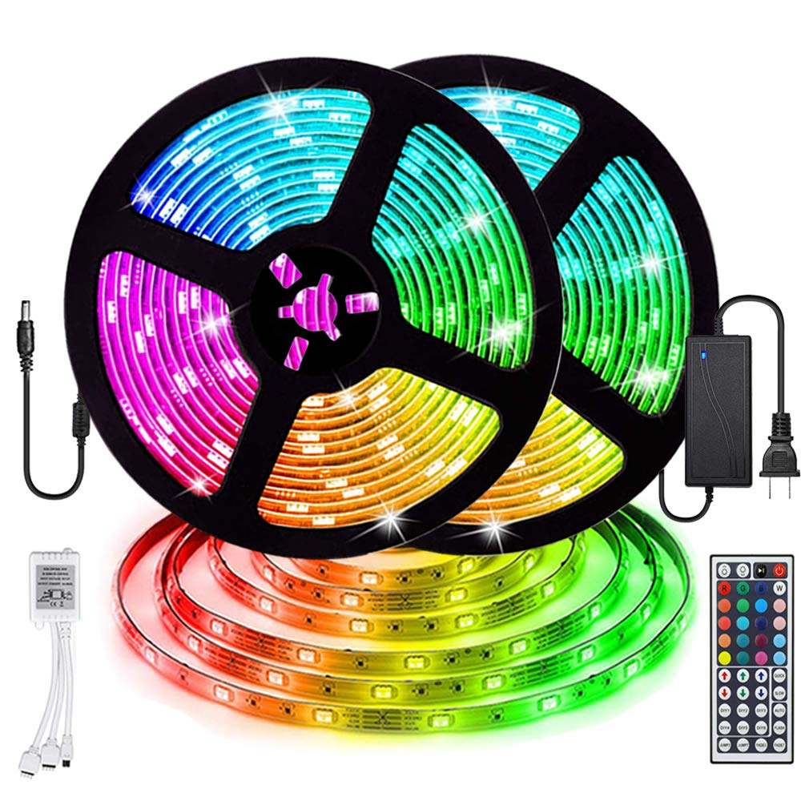
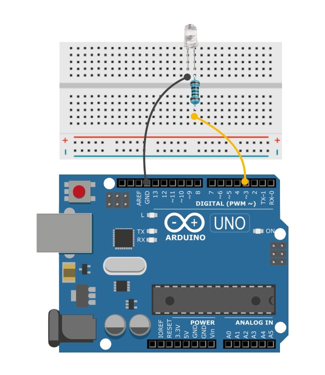
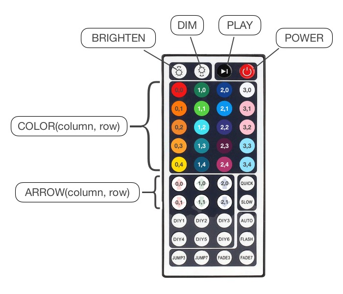

# FlashlightLED




An Arduino library that can programmatically manipulate the LED color changing light strips controlled by a 44 Key IR Remote.


\
\
\
\
\


## Getting Started
In the Arduino IDE, click **Sketch** >> **Include Library** >> **Manage Libraries...**

With the Arduino **Library Manger** window open, in the *_Filter your search..._* input type: *FlashlightLED*.

Select the *FlashlightLED* library and click *Install*.

Include the *FlashlightLED* library in your Arduino sketch.
```
#include <FlashlightLED.h>
```
---
## Build an Arduino IR Transmitter

Notes:
  - The IR LED short leg is ground.
  - Pin #3 **MUST** be used as the transmit pin. This library uses the Arduino IRremote library by Sherriff, which uses pin #3.
  - The resistor value in the image is 100ohm, but higher resistor values may be used to shorten the distance of the transmission when interference is an issue.
  - This library transmits on the IR NEC Protocol.
  <a href="https://exploreembedded.com/wiki/NEC_IR_Remote_Control_Interface_with_8051">NEC Protocol Tutorial</a>

<p align="center">
  
</p>

---

## <span style="color: #c60f13;"> WARNING!!! </span>
<p>
Potential fire hazard!
</p>

<p>
When the lights are coiled and powered on, enough heat is produced to melt the lights and reel. When under power
uncoil lights to prevent high heat condition.
</p>

---

## Sketch 1
Example sketch sends an IR signal equivalent of the *AUTO* button on the remote and then sends 
an IR signal equivalent to the <*increase brightness symbol*> button on the remote.
The LED light strips should enter into *AUTO* mode and set *FULL* brightness.

```
#include <FlashlightLED.h> // Import library;

FlashlightLED lights; // Now referenced as lights throughout sketch.

void setup(){
  // Serial Monitor @ 9600 baud
  Serial.begin(9600);
  lights.AUTO().BRIGHTEN();
}

void loop(){}
```

---

## IR Remote Button-To-Method Mapping Diagram

Notes:
- All methods in the library are capitalized e.g. QUICK, DIY3, SLOW, COLOR, RANDOM_COLOR etc...
- Any button with a printed word has a matched method i.e. the button with the word *FLASH* maps to the method FlashlightLED.FLASH().
- Any button with numbers displays the two arguments required to activate the corresponding button via the method displayed in the attached word bubble.

<p align="center">
  
</p>

### Button-To-Method Examples

Note: Assume the library has already been imported as *lights*.

```
// Choose red.
lights.COLOR(0,0);

// Choose white.
lights.COLOR(3,0);

// Choose fuchsia.
lights.COLOR(2,4);

// Choose green down arrow.
lights.ARROW(1,1);

// Choose play.
lights.PLAY();

// Choose FADE3.
lights.FADE3();
```
---

## Documentation

#### Luminosity

The following methods change the luminosity of the lights.

Notes:
- The IR Remote has eight luminosity settings. It takes seven clicks to get from full dim to full brightness or vice versa.
- Both the *BRIGHTEN* and *DIM* method default to 10 pulses to over compensate in case of a missed signal.

```
/*
Takes an optional integer parameter.
If no integer is provided ten pulses will be emitted.
When an integer is provided, the integer will be the number of pulses.
*/

BRIGHTEN(int)

DIM(int)
```

##### Additional method

The following method was added to attempt a specific luminosity.

Notes:
- The library cannot keep track of the current luminosity setting as there is no confirmation signal from the LED lights.
- The *LUMENS* method attempts full dim, then applies the default or supplied argument.
- If a level of six out of eight settings is desired, the method will first apply ten dimming pulses, then use the supplied 5 integer to count up from a dim setting of 1.

```
/*
Takes an optional integer parameter.
If no integer is provided four pulses will be emitted to achieve a middle luminosity.
When an integer is provided, the integer will be the number of pulses starting at full dim.
*/

LUMENS(int)
```

---

#### Flash Interval

The following methods change the speed of flashing lights.

Notes:
- The IR Remote has sixty luminosity settings. It takes sixty clicks to get from the longest to the shortest flash interval or vice versa.
- Both the *QUICK* and *SLOW* method default to 65 pulses to over compensate in case of a missed signal.

```
/*
Takes an optional integer parameter.
If no integer is provided 65 pulses will be emitted.
When an integer is provided, the integer will be the number of pulses.
*/

QUICK(int)

SLOW(int)
```

##### Additional method

The following method was added to attempt a specific flash interval.

Notes:
- The library cannot keep track of the current flash interval setting as there is no confirmation signal from the LED lights.
- The *SPEED* method attempts to set the longest flash interval, then applies the default or supplied argument.
- If a level of thirty out of sixty settings is desired, the method will first apply 65 dimming pulses, then use the supplied 30 integer to count up from a slow setting of 1.
```

/*
Takes an optional integer parameter.
If no integer is provided thirty pulses will be emitted to achieve a middle flash interval.
When an integer is provided, the integer will be the number of pulses starting at the longest interval setting.
*/

SPEED(int)
```
---

#### Color Selection

The following method is used to select one of the twenty selectable colors.

Notes:
- The IR Remote has twenty default colors to choose from.
- The *COLOR* method sends one pulse.

```
/*
Takes two required integer parameters: column #, row #.
Excepts a third optional luminosity integer.
If the luminosity integer is present, the *LUMENS* will run first, then the color signal will be sent.
The third optional parameter default is -1.
*/

COLOR(int, int, int)
```
##### Additional method

The following method was added for convenience.

Notes:
- The library cannot keep track of the current flash interval setting as there is no confirmation signal from the LED lights.
- The *SPEED* method attempts to set the longest flash interval, then applies the default or supplied argument.
- If a level of thirty out of sixty settings is desired, the method will first apply 65 dimming pulses, then use the supplied 30 integer to count up from a slow setting of 1.
```

/*
Takes one optional integer parameter: column #.
If an integer:column is supplied, the random selection will be confined to that column.
If no integer is provided, a random color will be selected from any column and row.
*/

RANDOM_COLOR(int:optional)
```
---
#### Color Variation

The following method is used to select a color arrow.

Notes:
- The IR Remote has six color arrows to choose from.
- The *ARROW* method sends one or more pulses.

```
/*
Takes two required integer parameters: column #, row #.
Excepts a third optional number of pulses integer.
The third optional parameter default is 1 pulse.
*/

ARROW(int:required, int:required, int:optional)
```
<style>
#foo {color: red}
</style>
